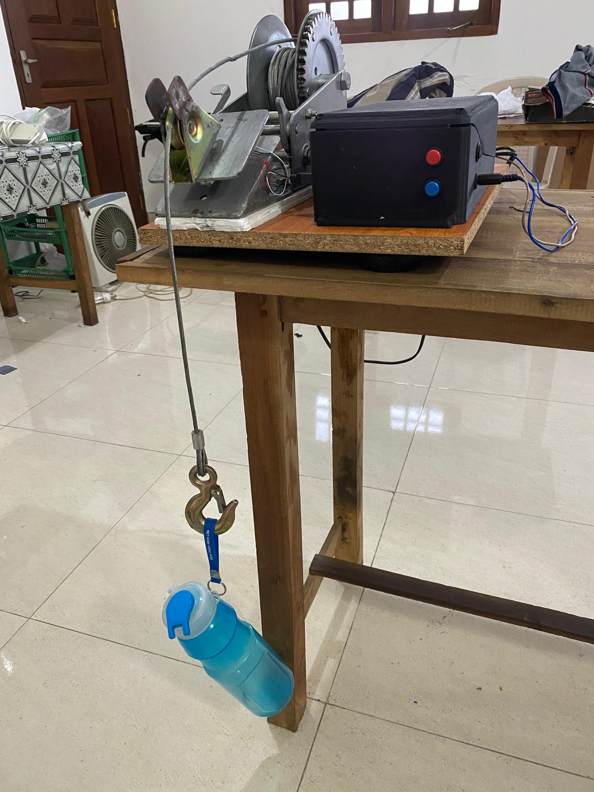
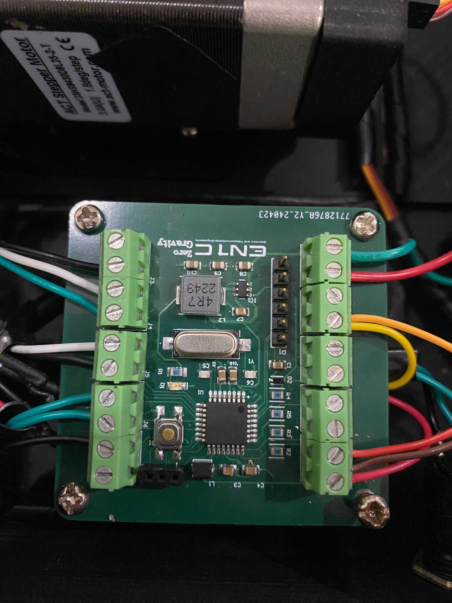

# Zero Gravity Lifting Device

<div align="center">
  
  <br>
  <em>Figure: SolidWorks Assembly of the Main Enclosure</em>
</div>

## 📋 Project Overview
The **Zero Gravity Lifting Device** is an advanced material handling solution designed to manipulate heavy, bulky, or irregularly shaped objects (5kg – 25kg) with minimal user effort. Developed as part of the **EN2160** module at the **University of Moratuwa**, this device utilizes a precise control system to simulate a "zero-gravity" float mode, significantly reducing ergonomic hazards and improving safety in industrial environments.

## 🚀 Key Features
* **Zero Gravity Float Mode:** Allows users to manipulate loads with minimal physical strain.
* **Payload Capacity:** Designed for objects weighing between **5kg and 25kg**.
* **Precision Control:**
    * Adjustable lifting speed: **0.1 m/s – 0.3 m/s**.
    * Positioning accuracy: **±5 mm**.
* **Safety Mechanisms:** Integrated emergency stop and overload protection.
* **Custom Enclosure:** 3D-printed ABS enclosure designed for industrial safety and moldability.

## 🛠️ System Architecture

### 1. Mechanical Design
The mechanical system is designed to amplify torque and measure cable tension effectively:
* **Actuation:** A winch mechanism driven by a stepper motor via a **1:9 ratio gearbox**.
* **Load Cell Converter:** Due to the unavailability of S-type load cells, a custom **Single-Point Beam Load Cell** converter mechanism was designed to calculate cable tension by directing a force component to the sensor.
* **Material:** Steel components used for the pulling device; ABS used for enclosures.

### 2. Electronics & PCB
The system is powered by a custom 4-layer PCB designed in Altium Designer.
* **Microcontroller:** ATmega328P (SMD).
* **Motor Driver:** TB6600 (controlling a NEMA 23 Stepper Motor).
* **Sensors:**
    * **Load Cell:** 20kg capacity with **HX711** 24-bit ADC Amplifier.
    * **Feedback:** AS5600 Magnetic Encoder.
* **Power:** 230V AC input converted to 12V DC (5A max) with a TSOT26 Buck Converter for logic levels.

<div align="center">
  
  <br>
  <em>Custom 4-Layer PCB Design (Altium)</em>
</div>

### 3. Software & Control Algorithm
The core logic runs on the ATmega328P using a **PID Control Algorithm**. The system aims to maintain the rate of change of force ($dF/dt$) at zero to achieve the zero-gravity effect.

**Control Loop:**
1.  **Input:** Rate of change of tension (measured via Load Cell/HX711).
2.  **Processing:** PID controller calculates the required motor response to neutralize the user's external impact.
3.  **Output:** Velocity commands sent to the NEMA 23 stepper motor.

**Key Libraries:**
* `AccelStepper.h`: For smooth motor acceleration and control.
* `HX711.h`: For load cell data acquisition.
* `millis.h`: Lightweight millisecond tracking for non-blocking code.

## 📂 Repository Structure
```text
├── Electronics/
│   ├── Altium_Project/      # Schematics and PCB Layouts
│   ├── BOM/                 # Bill of Materials
│   └── Datasheets/          # Component documentation
├── Mechanical/
│   ├── SolidWorks/          # SLDPRT and SLDASM files
│   └── Renders/             # 3D Renders of enclosures
├── Firmware/
│   ├── src/                 # Main.c and helper headers
│   └── libraries/           # HX711 and Millis libraries
└── Docs/
    └── Design_Report.pdf    # Full technical documentation
